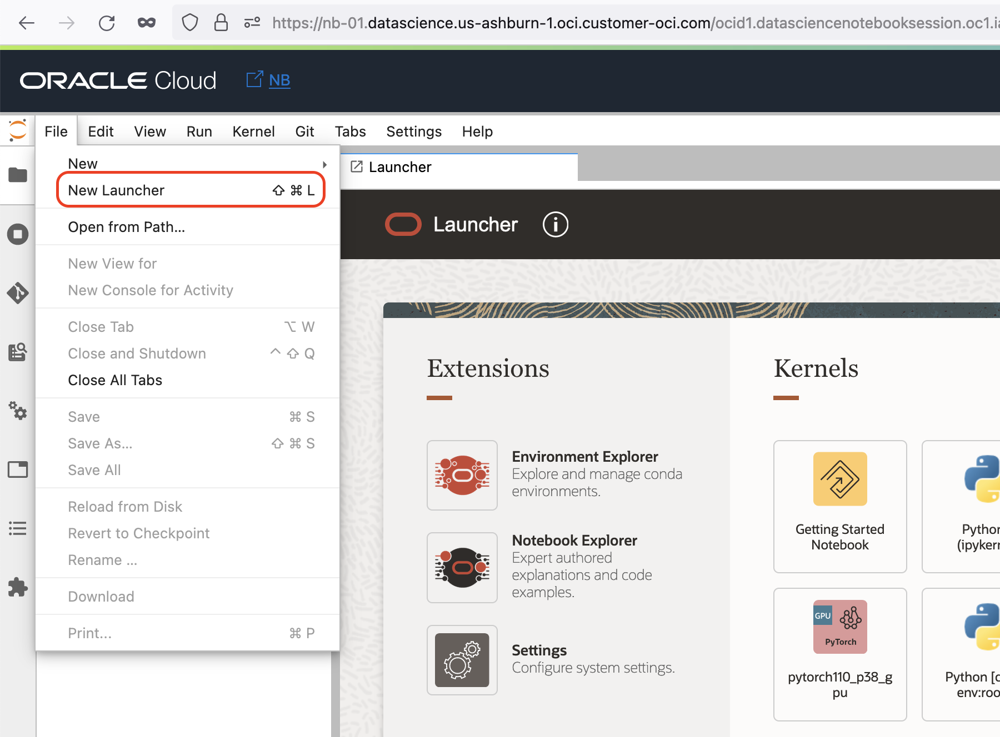
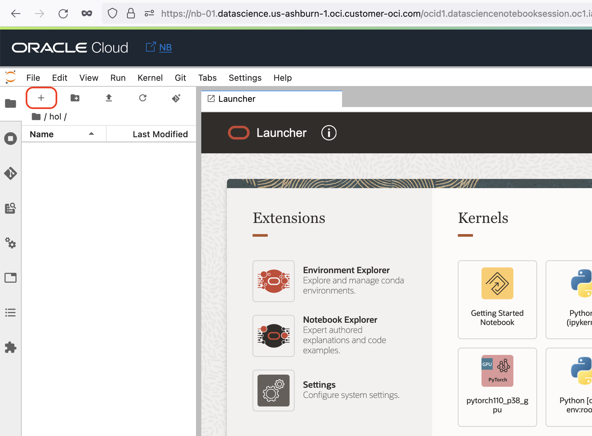
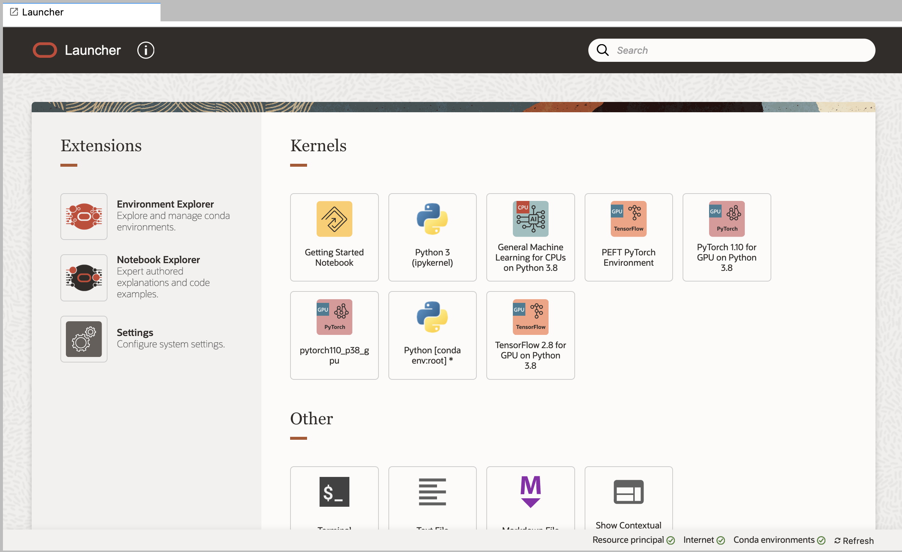
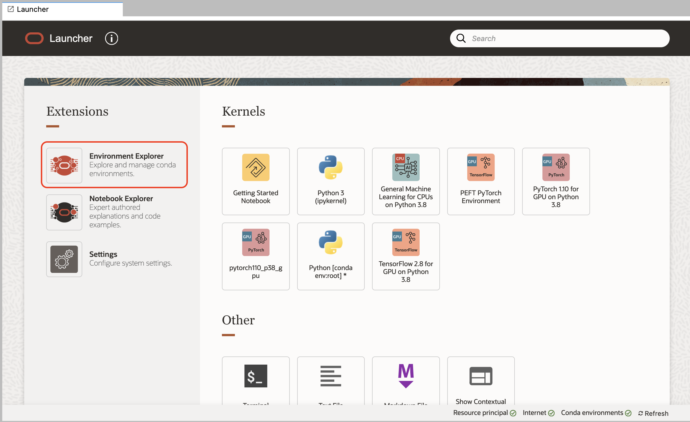
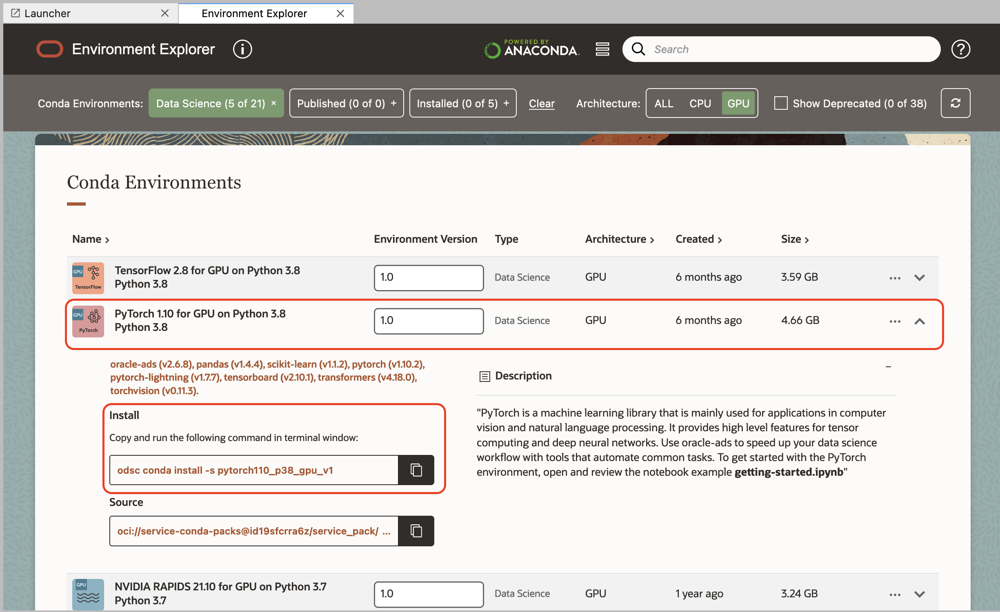
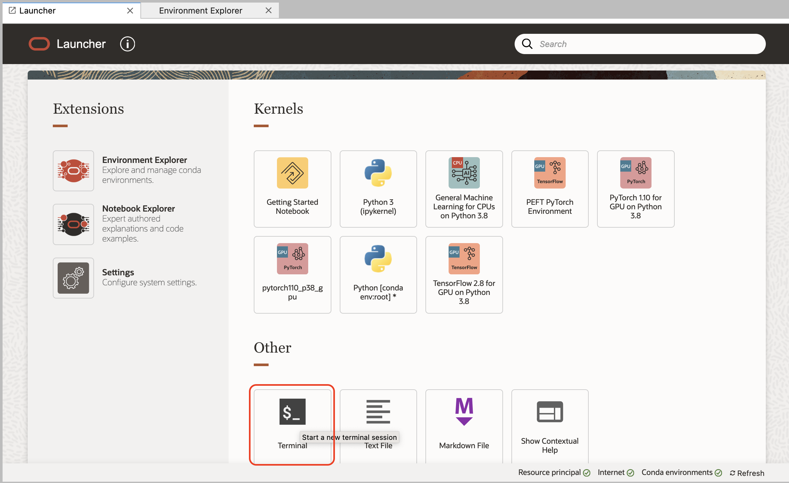
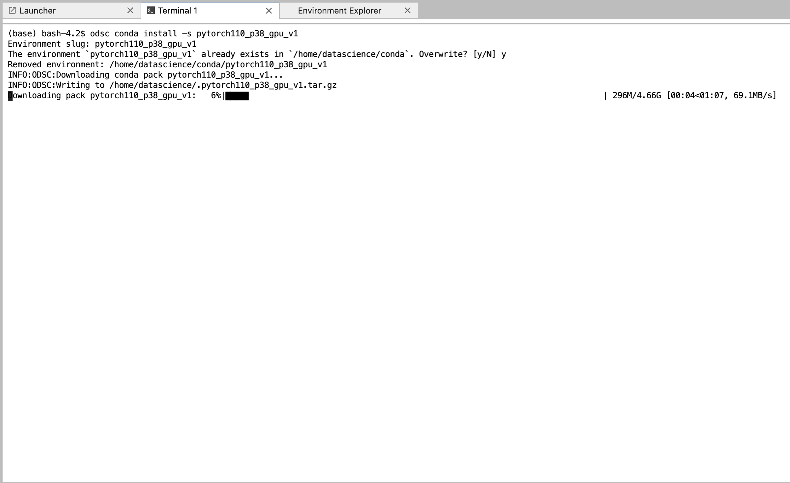
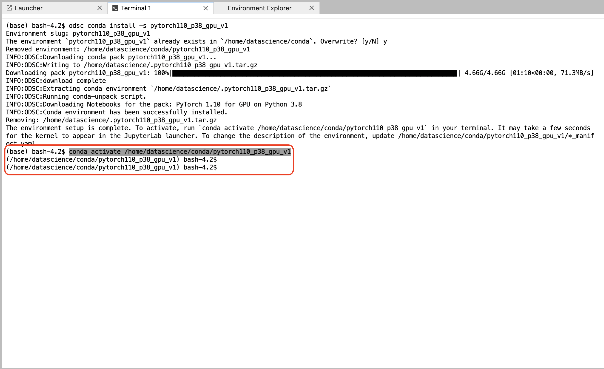

# Setup the Environment

## Introduction

To proceed with the lab you would need Oracle Cloud account and access to the Oracle Cloud Infrastructure Data Science and AI Services.

Estimated Time - 5 minutes

### Objectives

* Install and activate the required Conda environment
* Install dependencies
* Create project folder

### Prerequisites

* OCI account
* A Data Science notebook session

## Task 1: Install and activate required Conda environment

1. Once your notebook is open select `File -> New Launcher` ...

    

    or click on the Plus `+` icon.

    

    This would open he Launcher which looks like this:

    

2. Open the `Environment Explorer` by clicking on the Extensions Icon

    

3. In the Environment Explorer filter under `Conda Environments` select `Data Science` and under `Architecture` select `GPU`:

    

4. Open the `PyTorch 1.10 for GPU on Python 3.8 Python 3.8` and click on the `Copy` button under the Install section

    ```bash
    <copy>odsc conda install -s pytorch110_p38_gpu_v1</copy>
    ```

    

5. Go back to the `Launcher` and click on the `Terminal` icon
    

6. In the newly open terminal past the Conda installation command and hit enter to install it
    

    ... confirm with `y` the installation

    

    ... wait for the installation to complete
    

7. Activate the conda environment by executing following after the installation completes:

    ```bash
    <copy>conda activate /home/datascience/conda/pytorch110_p38_gpu_v1</copy>
    ```

    

## Task 2: Install dependencies

1. Now that we have the required conda environment ready, we would need to install some additional python dependencies required for the following code.

   You can install the dependencies by running following line in the Terminal.

    ```bash
    <copy>pip install transformers evaluate sentencepiece datasets</copy>
    ```

## Task 3: Create project folder

1. You could work in the notebook root folder under `/home/datascience` but we recommend you to create a subfolder for the project.

   In the terminal run:

    ```bash
    <copy>mkdir hol</copy>
    ```

   ... and then enter the folder with

    ```bash
    <copy>cd hol</copy>
    ```

You may now **proceed to the next lab**.

## **Acknowledgements**

* **Authors** - Lyudmil Pelov, Wendy Yip, Yanir Shahak
