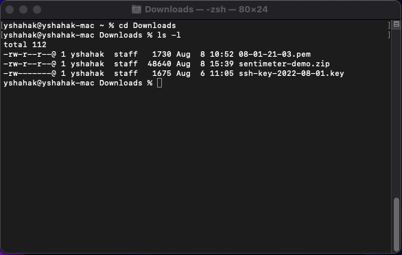
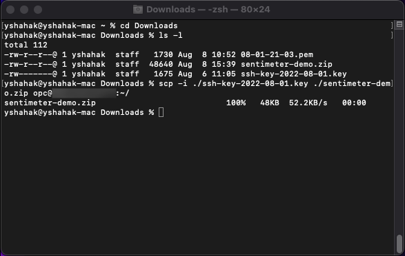
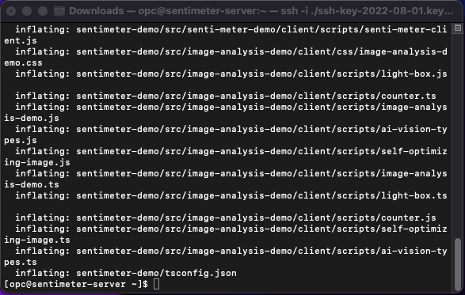
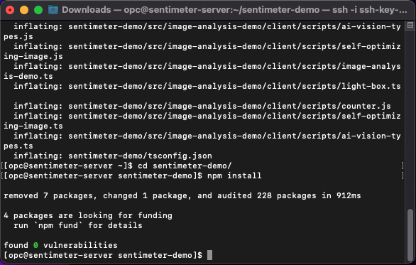
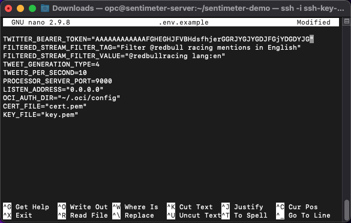
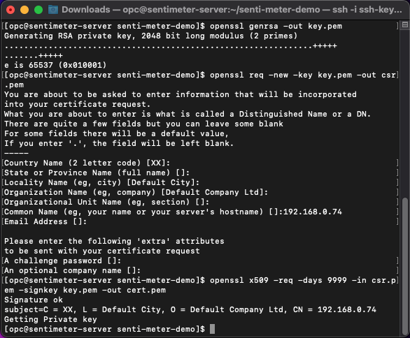
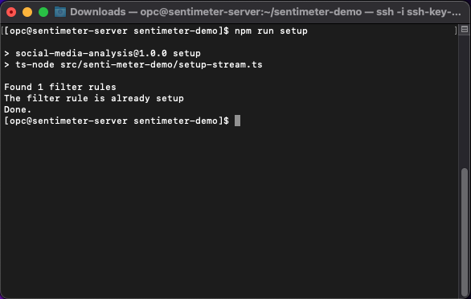
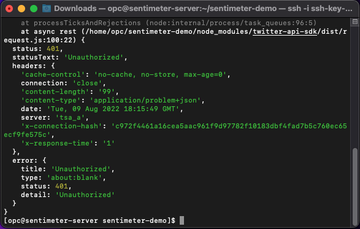
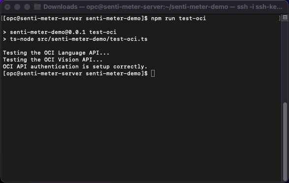

# Deploy the demo code to the Compute Instance

## Introduction

In pervious steps we configured a Twitter developer account and a Compute Instance to run our demo.
In the following steps, we will copy and configure the demo code on the Compute Instance.

### Objectives

* Download and copy the source code to the Compute Instance.
* Extract the source code.
* Configure the source code.
* Create a self-signed TLS certificate.
* Test the configuration.

## Task 1: Download and copy the source code to the Compute Instance

1. Using this [link](files/senti-meter-demo.zip?download=1), download the zip file containing the source code and save it on your computer. As before, the default location for saving downloaded files is the `Downloads` folder.

2. As we did with the `API Key` file, we are going to copy the source code zip file to the Compute Instance.
If you have the two terminal windows active, please switch to the terminal window showing your local `Downloads` folder (or the location where you have saved the downloaded files thus far).
If you need to start a new terminal window, please refer to the [previous lab](?lab=create-and-connect-to-an-oci-compute-instance#Task2:ConnecttotheComputeInstanceusingSSH).

3. If you have started a new terminal window,  use the `cd` command to switch to the folder where the downloaded source code zip file was saved (`Downloads` in our example).

    

4. Use the following `scp` command to copy the source code zip file from your computer to the Compute Instance over the network:

    * On a `Mac` computer, use the following command:

    ```bash
    Downloads % <copy>scp -i ./[key file name].key ./senti-meter-demo.zip opc@[compute instance IP]:~</copy>
    ```

    * On a `Windows` computer, use the following command:

    ```bash
    C:\Users\username\Downloads><copy>scp -i ./[key file name].key ./senti-meter-demo.zip opc@[compute instance IP]:~</copy>
    ```

    Here's an example of whats this command might look like:

    ```bash
    scp -i ./ssh-key-2022-08-01.key ./senti-meter-demo.zip opc@192.168.15.76:~
    ```

    Here's an example of how the terminal output might look for a successful copy:

    

    At this point, the source code zip file resides on the Compute Instance under the `~` folder (`~` means the home folder for the current user (`opc`) which in our case means `/home/opc`, therefore, the full path of the source code zip file on the Compute Instance will be: `/home/opc/senti-meter-demo.zip`). We will use this information in the following step.

## Task 2: Extract the source code

As the source code was copied in a compressed zip file, we will now extract the contents of this file into the code's final form.

1. Using the connected terminal (if you closed the connected terminal, please refer to the [previous lab](?lab=create-and-connect-to-an-oci-compute-instance#Task2:ConnecttotheComputeInstanceusingSSH).), move to the home folder and list its content using the following two commands:

    ```bash
    [opc@senti-meter-server ~]$ <copy>cd ~</copy>
    [opc@senti-meter-server ~]$ <copy>ls -l</copy>
    ```

    You should see the following output:

    

2. Using the `unzip` command we will extract the contents of the zip file:

    ```bash
    [opc@senti-meter-server ~]$ <copy>unzip senti-meter-demo.zip -d senti-meter-demo</copy>
    ```

    This command will extract the contents of `senti-meter-demo.zip` into a folder called `senti-meter-demo`.  
    A successful execution will show an output similar to:

    

## Task 3: Configure the source code

Soon our demo will to be ready to run. In this step we will install the software packages used by the demo code as well as perform some configuration in preparation for the demo execution.

1. Using the connected terminal, move to the `senti-meter-demo` folder:

    ```bash
    [opc@senti-meter-server ~]$ <copy>cd ~/senti-meter-demo</copy>
    ```

2. Using the `npm` command, we will install the packages needed for the demo:

    ```bash
    [opc@senti-meter-server senti-meter-demo]$ <copy>npm install</copy>
    ```

    This command might take a few minutes to complete and the output should look similar to this:

    

3. The demo uses a file called `.env` stored at the root of the source code to keep important parameters which control the demo's behavior.  
   The source code includes a file called `.env.example` which contains defaults to many of those parameters, but we would need to at least update the Twitter `Bearer Token` in this file for the demo to work properly (covered in a [previous lab](?lab=create-a-twitter-developer-account#Task3:CreatingaTwitterapp)).  
   After updating `.env.example` we will rename it to `.env` for it to be picked up by the demo.  
   As we've done before with the authentication configuration file, we are going to use the `nano` text editor to edit this file:

    ```bash
    [opc@senti-meter-server senti-meter-demo]$ <copy>nano .env.example</copy>
    ```

    The default file would look like this:

    

    Here is a rundown of the various parameters in the file (optional information):

    |Parameter Name|Used For|
    |--------------|--------|
    |`TWITTER_BEARER_TOKEN`|Authenticating with the Twitter API. This value was generated when we created our Twitter application [here](?lab=create-a-twitter-developer-account#Task3:CreatingaTwitterapp)|
    |`FILTERED_STREAM_FILTER_TAG`|Naming the filter rule by which we will filter the stream of tweets flowing from Twitter|
    |`FILTERED_STREAM_FILTER_VALUE`|The filter expression used to tell the Twitter API which tweets we care about. The default value asks for tweets mentioning `@redbullracing` and written in English|
    |`TWEET_GENERATION_TYPE`|Controlling the sentiment of tweets generated by the tweet generator. 0 = Negative, 1 = Trending Negative, 2 = Balanced, 3 = Trending Positive, 4 = Positive|
    |`TWEETS_PER_SECOND`|Controlling the pace of tweets generated by the tweets generator|
    |`IMAGE_QUERY`|Controlling the query filter used in the Vision AI demo to download images attached to tweets|
    |`PROCESSOR_SERVER_PORT`|This is the TCP port our server will be listening on|
    |`LISTEN_ADDRESS`|Specifying the IPv4 address our server will bind to|
    |`OCI_AUTH_DIR`|Specifying where the OCI API authentication information is kept|
    |`CERT_FILE`|Naming the TLS certificate file used to secure the connection to the server|
    |`KEY_FILE`|Naming the TLS key file used to secure the connection to the server|

    On the first line of the file, replace `[BEARER TOKEN VALUE]` (keeping the double quotes) with the `Bearer Token` value  we saved when we created the Twitter App [here](?lab=create-a-twitter-developer-account#Task3:CreatingaTwitterapp).

    The end result should look similar to this:

    

    When done, press `Ctrl+X`, type `y` as a response to the question `Save modified buffer?` and press `Enter`.  
    The parameters file will be saved and ready to use.

4. Rename the `.env.example` file to `.env` as this is the file name expected by the demo:

    ```bash
    [opc@senti-meter-server senti-meter-demo]$ <copy>mv .env.example .env</copy>
    ```

## Task 4: Create a self-signed TLS certificate

In this step we will create the TLS certificate and key files required to establish a "secure connection". These files are similar to the ones used by production website to verify the authenticity of the website. Any website accessed using `https://` at the start of its URL should have a valid TLS certificate. In our case, we will be generating a `self-signed` certificate which means we will be able to use it for the purposes of this demo but it will not be recognized by the browser as a valid certificate (more on that later).

1. In your connected terminal, execute the following commands:

    ```bash
    [opc@senti-meter-server senti-meter-demo]$ <copy>openssl genrsa -out key.pem</copy>
    [opc@senti-meter-server senti-meter-demo]$ <copy>openssl req -new -key key.pem -out csr.pem</copy>
    ```

    The second command will prompt you for several pieces of information.
    Please keep pressing `Enter` to skip these prompts until you reach the following prompt:

    ```text
    Common Name (eg, your name or your server's hostname) []:
    ```

    As a response to this prompt, please type the Compute Instance's IP address and press `Enter`.
    Keep pressing `Enter` for all of the remaining prompts and then, execute the following commands:

    ```bash
    [opc@senti-meter-server senti-meter-demo]$ <copy>openssl x509 -req -days 9999 -in csr.pem -signkey key.pem -out cert.pem</copy>
    [opc@senti-meter-server senti-meter-demo]$ <copy>rm csr.pem</copy>
    ```

    The at the end of the process, your terminal should look similar to this:

    

    Please verify that `cert.pem` and `key.pem` files were created in the demo's root folder (`~/senti-meter-demo/`) by listing the files in the folder:

    ```bash
    [opc@senti-meter-server senti-meter-demo]$ <copy>ls -l</copy>
    ```

    The output should look similar to the following:

    

    If either of the files does not exist in the folder, please repeat the steps in this section.

## Task 5: Test the configuration

In this section we will make sure that all of our configuration steps created the necessary environment for the demo to run in.

1. First we will setup the Twitter filter rule which lets Twitter know which tweets we are interested in. Executing this step will test the `Bearer Token` configuration and our access to the Twitter API.  
In the connected terminal, execute the following command:

    ```bash
    [opc@senti-meter-server senti-meter-demo]$ <copy>npm run setup</copy>
    ```

    The output of this command should look similar to this:

    

    If the command execution fails with an error similar to:

    

    Please verify the following:
    * `.env` file exists in `~/senti-meter-demo/`
    * `.env` contains a valid value for `TWITTER_BEARER_TOKEN` as copied from the [Twitter Developer Portal](https://developer.twitter.com/en/portal/dashboard) in a [previous lab](?lab=create-a-twitter-developer-account#Task3:CreatingaTwitterapp). The value must be comprised from upper-case and lower-case letters as well as some special characters (but no spaces) and surrounded by double quotes like so: `TWITTER_BEARER_TOKEN="AAAAABfshjeBEGHGHSHFHdfhfehgf"`
    * If after validating the above steps the command still fails to execute, please re-generate the `Bearer Token` for your Twitter Application on the [Twitter Developer Portal](https://developer.twitter.com/en/portal/dashboard) and repeat the steps to update the new `Bearer Token` in `.env`.

2. As our second validation step, we will test the OCI API authentication configuration.  
In the connected terminal, execute the following command:

    ```bash
    [opc@senti-meter-server senti-meter-demo]$ <copy>npm run test-oci</copy>
    ```

    The output of this command should look similar to this:

    

    If the output in your terminal is different or you are seeing any error messages, please verify the following:
    * Verify that `~/.oci/config` exists and contains all of the required information.
    * In `~/.oci/config`, the value for `key_file` looks similar to: `~/.oci/08-01-21-03.pem` (but ends with your `API Key` file name).
    * The file specified in the value to `key_file` exists.
    * If all else fails, please repeat the steps in the [previous lab](?lab=setup-oci-api-authentication) where we have configured the OCI API authentication.

You may now **proceed to the next lab**.

## Acknowledgements

* **Authors:**
	* Yanir Shahak - Senior Principal Software Engineer, Health & AI