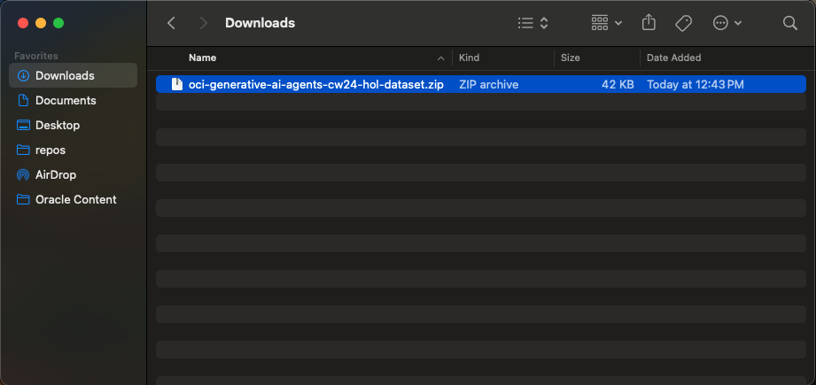
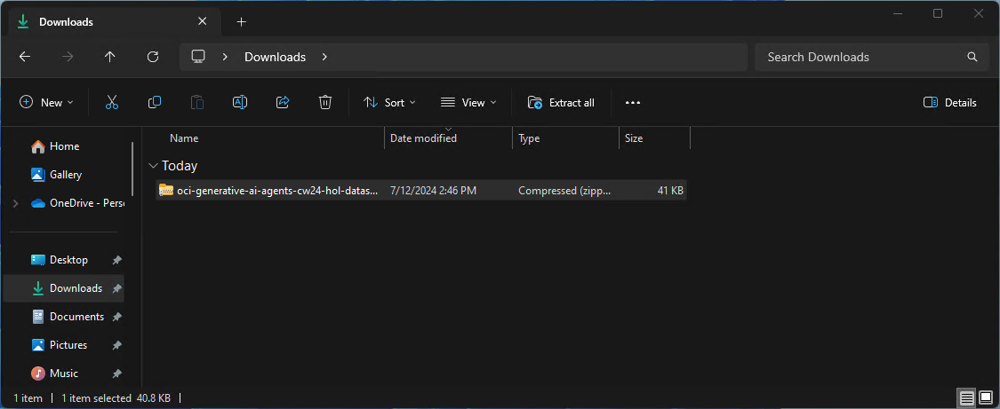
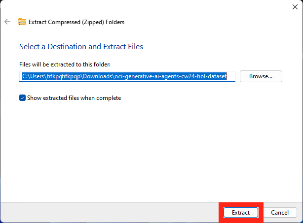
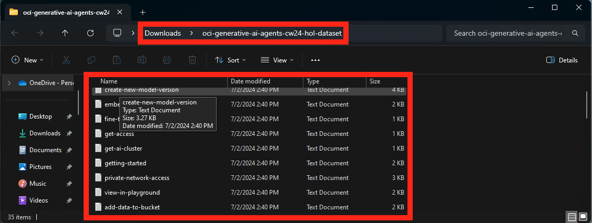
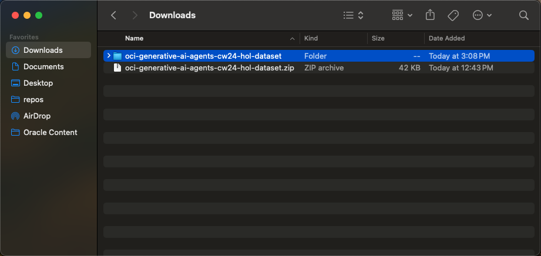
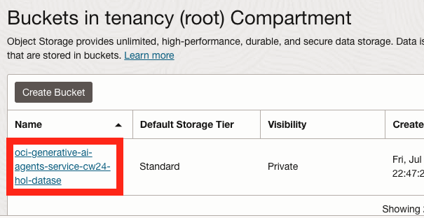
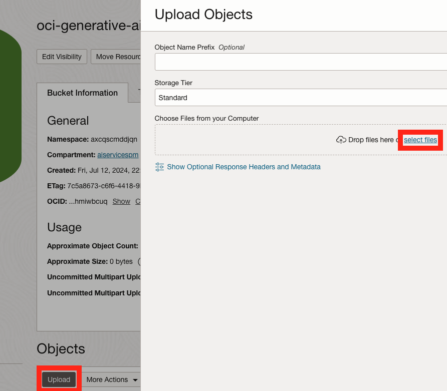
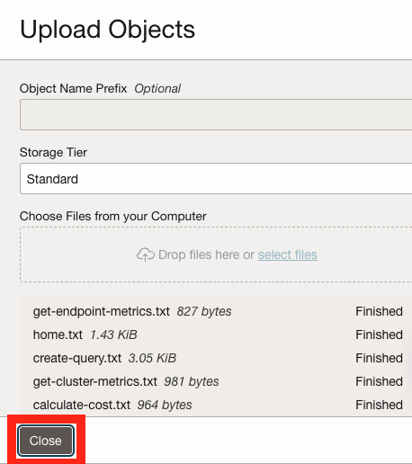

# Prepare the dataset

## Introduction

This lab will walk you through how to upload data to be ingested and indexed by the OCI Generative AI Agents service.
The dataset is the fuel for the service. After the data has been indexed, you will be able to ask complex questions about it and have the service answer those questions like a human would.
In this lab, you will be using a dataset we have created for you which contains parts of the OCI Generative AI service documentation. This will allow the Agent to answer user questions about the service.

Estimated Time: 10 minutes

### Objectives

In this lab, you will:

* Download and unzip the sample dataset we have prepared for you.
* Create a storage bucket to store the dataset.
* Upload the dataset to the storage bucket.

### Prerequisites

This lab assumes you have:

* An Oracle Cloud account
* All previous labs successfully completed

## Task 1: Download and unzip the sample dataset

1. Click [this link](https://c4u04.objectstorage.us-ashburn-1.oci.customer-oci.com/p/EcTjWk2IuZPZeNnD_fYMcgUhdNDIDA6rt9gaFj_WZMiL7VvxPBNMY60837hu5hga/n/c4u04/b/livelabsfiles/o/labfiles%2Foci-generative-ai-agents-cw24-hol-dataset.zip) to download the `zip` archive containing the dataset text files.
  The `zip` archive will be downloaded to your configured `Downloads` folder.
  On `Windows` computers, downloaded files would be saved in `C:\Users\[user name]\Downloads` by default.
  For `Mac` computers, downloaded files would be saved in `/Users/[user name]/Downloads` by default.

1. Locate the downloaded `zip` archive in your download folder using `File Explorer` on `Windows` or `Finder` on `Mac`.

  

  

1. To extract the text files from the `zip` archive:

   On `Windows`:

    1. Right click the `zip` file.

    1. Select **Extract All** from the menu.

    1. Click the **Extract** button on the bottom.

    1. The text files will usually be extracted into a folder with the exact name as the `zip` file.

  

  

  

   On `Mac`:

    1. Double click the `zip` file.

    1. The text files will usually be extracted into a folder with the exact name as the `zip` file.

  

## Task 2: Create a storage bucket & upload the dataset

1. On your OCI tenancy console, click the **Navigation Menu**.

1. Click **Storage**.

1. Click **Buckets** on the right, under **Object Storage & Archive Storage**.

  

1. Under **List scope**, make sure that the **root** compartment is selected.

1. Click the **Create Bucket** button on the top of the **Buckets** table.

  

1. Provide a name for the bucket (example: oci-generative-ai-agents-service-cw24-hol-dataset).

1. For the purpose of this workshop, we are going to accepts the default values for the rest of the form.

  Click the **Create** button on the bottom of the panel.

  

1. Click the new bucket's name in the **Buckets** table.

  

1. Under the **Objects** section of the page, click the **Upload** button.

1. Click the **select files** link in the **Choose Files from your Computer** section.

  

1. In your `File Explorer` or `Finder`, navigate to the folder containing all of the `.txt` files extracted in the previous task.

1. Select all of the files from the folder and click `Open`.

  

1. Click the **Upload** button at the bottom of the panel.

  

1. Click the **Close** button at the bottom of the panel.

  

If everything went to plan, you should see all of the files listed under the **Objects** section of the page.

## Acknowledgements

* **Author** - Lyudmil Pelov, Senior Principal Product Manager, Yanir Shahak, Senior Principal Software Engineer
